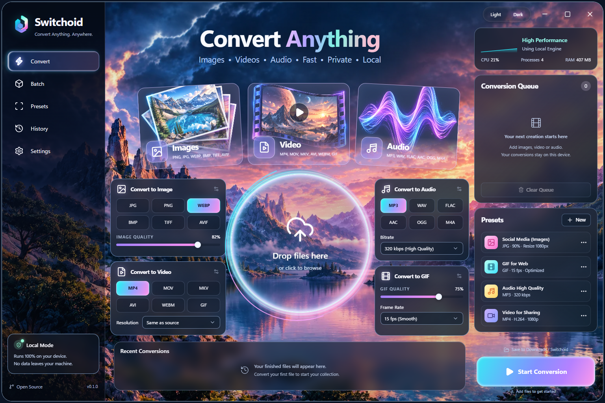

# Switchoid

**Convert anything. Anywhere.** A local-first Windows Electron app for images, videos, audio, and GIFs by [Lehro Solutions](https://github.com/LehroSolutions).

[MIT license](LICENSE) · [Contributing](CONTRIBUTING.md) · [Security](SECURITY.md) · [Launch checklist](docs/LAUNCH.md)



## Install on Windows

Windows 10/11, x64. Run `Switchoid-Setup-0.1.0-x64.exe` and follow the setup wizard. The per-user installer creates desktop and Start menu shortcuts and includes FFmpeg, FFprobe, and Sharp; no Node.js, Bun, or separate codecs are needed to use the installed app.

Look for **Switchoid-Windows-x64** artifacts on successful runs of the [Windows build workflow](https://github.com/LehroSolutions/Switchoid/actions/workflows/windows.yml). Each artifact contains the installer, complete media-engine source archive, provenance, third-party notices, and `.sha256` checksums. Artifact downloads require repository access and a GitHub login. This initial build is unsigned, so Windows may show an unknown-publisher prompt.

After extracting the artifact, compare `Get-FileHash -Algorithm SHA256 .\Switchoid-Setup-0.1.0-x64.exe` with the supplied checksum before running it. Maintainer-published installers, when available, will appear on the [releases page](https://github.com/LehroSolutions/Switchoid/releases).

To uninstall, use Windows **Settings → Apps → Installed apps → Switchoid**. Existing settings and conversion history are preserved. Original media files are never removed by the installer or uninstaller.

## Features

- Image conversion: JPG, PNG, WebP, BMP, TIFF, and AVIF, with resize, quality, crop, rotation, and metadata controls.
- Video conversion: MP4, MOV, MKV, AVI, WebM, and GIF, with resolution, frame rate, trimming, and audio options.
- Audio conversion: MP3, WAV, FLAC, AAC, OGG, Opus, and M4A, with bitrate, normalization, fades, and trimming.
- Drag-and-drop/file picker, parallel conversions, queued/running cancellation, presets, and conversion history.
- Dark/light/system appearance, reduced motion, and a dashboard inspired by the supplied design reference.
- Processing stays on your device. The app does not upload your media.

The exact set of readable inputs depends on the included decoder libraries. HEIC export and video-to-image-sequence export are not implemented. See [verification notes](VERIFICATION.md) for tested behavior and current limits.

## Develop

Prerequisites: Windows x64, [Node.js 24](https://nodejs.org/), [Bun 1.3.14](https://bun.sh/), and Docker Desktop with Linux-container support to compile bundled media engines. Docker is only needed for engine builds, and is not needed to use the installed application.

```powershell
git clone https://github.com/LehroSolutions/Switchoid.git
cd Switchoid
bun install --frozen-lockfile
bun run media:prepare
bun run dev
```

`media:prepare` compiles FFmpeg/FFprobe 8.1.3 and the required codec libraries from SHA-256-pinned source archives, using the digest-pinned Docker recipe in `scripts/media/`. It prepares the binaries, dependency license notices, build evidence, and complete corresponding-source archive. Verified resources and build downloads are reused from local caches; installed conversion works offline. See [engine rebuild instructions](scripts/media/README.md).

Locked dependency installation also downloads the pinned Electron runtime through the project's `postinstall` script. Electron 44 requires this explicit preparation step. Runtime installation and packaging use Node.js's trusted system certificate store for downloads.

```powershell
bun run build       # Regenerate icons, typecheck, and build Electron
bun start           # Run the production build
bun run test        # Native Sharp/FFmpeg conversion tests
bun run test:ui     # Playwright against real Electron
bun run media:verify # Verify engines, required codecs, notices, and every source archive
bun run test:media  # Check incomplete or modified distributions are rejected
bun run audit      # Fail on dependency advisories or audit errors
bun run docs:build  # Generate the local documentation site
bun run package    # Build an unpacked Windows app
bun run dist       # Build installer + corresponding source, notices, provenance, and checksums
bun run test:installer # Install, test with an isolated profile, then uninstall
```

Finish the production build before running UI tests; rebuilding during a test can remove its loaded assets. Tests use isolated temporary user-data/output folders.

Installer testing requires a finished `dist` build and a closed application. To test an existing installation, run `bun run test:installer -AllowExistingInstall`; the new installer is restored after testing, and settings/history/presets must retain their original hashes.

To test a packaged or installed executable:

```powershell
$env:SWITCHOID_EXECUTABLE = (Resolve-Path 'release\win-unpacked\Switchoid.exe').Path
bun run test:ui
Remove-Item Env:\SWITCHOID_EXECUTABLE
```

## Project layout

| Path | Responsibility |
| --- | --- |
| `src/main/` | Local engines, queue, persistence, Electron window and IPC |
| `src/preload/` | Typed bridge with context isolation |
| `src/renderer/` | React dashboard, views, styling, artwork, favicons |
| `src/shared/` | Types, media defaults, and IPC channel names |
| `build/brand-source.svg` | Original supplied Lehro logo |
| `scripts/prepare-icons.mjs` | Reproduce Windows ICO/PNG and SVG favicon |
| `scripts/prepare-media.mjs` | Prepare pinned bundled media engines |
| `.github/workflows/windows.yml` | Build, native/UI tests, Windows installer artifact |

Source, artwork, and icon assets are versioned. `node_modules/`, build output, installers, native media binaries, local test results, and caches are ignored. Runtime settings, presets, and history are stored under Electron's per-user data directory; outputs default to `Downloads/Switchoid` unless another folder is chosen.

## License

Switchoid's source uses the [MIT license](LICENSE). Bundled dependencies retain their own licenses, including GPLv3 for the separate FFmpeg/FFprobe executables. See [third-party notices](THIRD_PARTY_NOTICES.md). Lehro Solutions branding retains its trademark identity.
